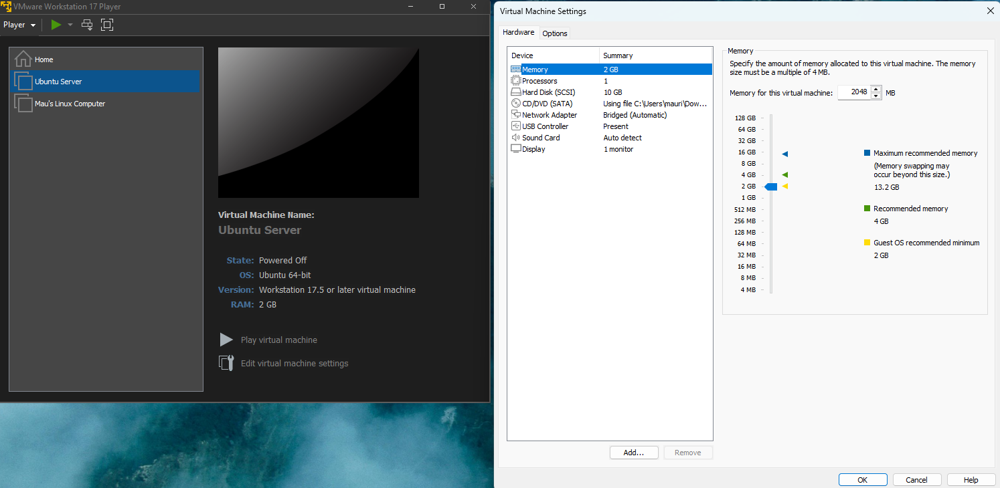
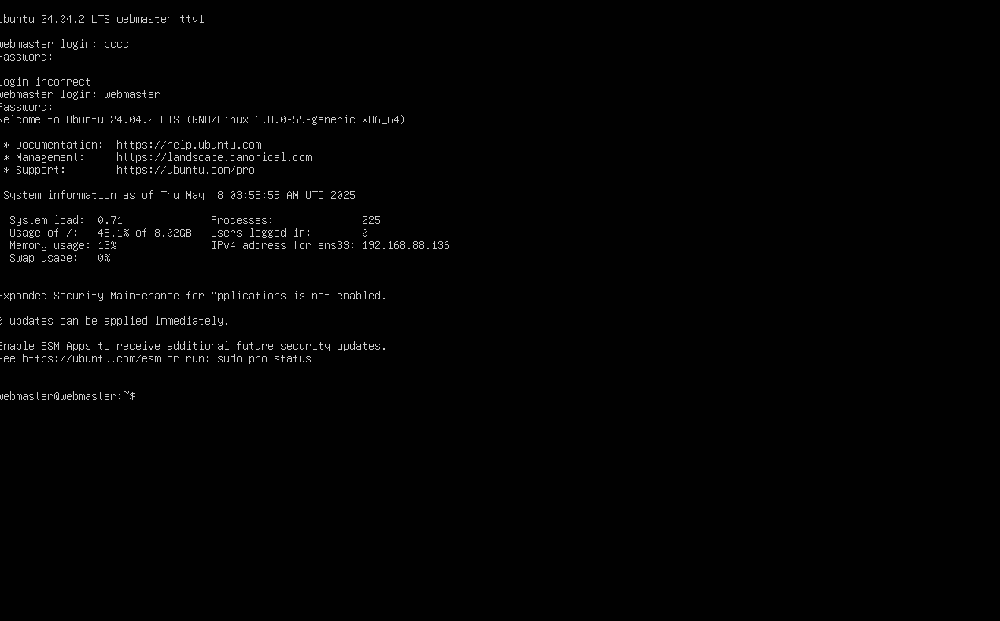

# Deliverable 2 Submission

## Server Specifications

## Ubuntu Login Screen

### Questions

3. **What is the IP address of your Ubuntu Server Virtual Machine?**
The IP address of my Ubuntu Server VM is `192.168.88.136`
4. **How do you enable the Ubuntu Firewall?**
You enable the Ubuntu Firewall by using the following command: `sudo ufw enable`
5. **How do you check if Ubuntu Firewall is running?**
You check the status of Ubuntu Firewall by using the following command: `sudo ufw status`
6. **How do you disable the Ubuntu Firewall?**
To disable the Ubuntu Firewall you input the following command: `sudo ufw disable`
7. **How do you add Apache to the Firewall?**
To add Apache to the Firewall I used the following command: `sudo ufw allow 'apache'`
8. **What is the command you used to install Apache?**
The command I used to install Apache was: `sudo apt install apache2 -y`
9. **What is the command you use to check if Apache is running?**
The command I used to check if Apache is running is the following: `systemctl status apache --no-pager`
10. **What is the command you use to stop Apache?**
To stop Apache you use the following command: `sudo systemctl stop apache2` 
11. **What is the command you use to restart Apache?**
To restart Apache you use the following command: `sudo systemctl restart apache2`
12. **What is the command to test Apache configuration?**
The command to test the Apache configuration is: `sudo apache2ctl configtest`
13. **What is the command used to check the installed version of Apache?**
The command to check the installed version of Apache is: `apache2 -v`
14. **What are the most common commands to troubleshoot Apache errors? Provide a brief description of the command.**
The most common commands to troubleshoot Apache errors are:
    * To check status of Apache: `systemctl status apache2`
    * To add apache to the Firewall: `sudo ufw allow 'apache'`
    * To check the installed version of Apache: `apache2 -v`
    * To stop Apache: `sudo systemctl stop apache2`
    * To restart Apache: `sudo systemctl restart apache2`
15. **Which are Apache Log Files, and what are they used for? Provide examples and screenshots.**
Apache log files are text files that store records of events, requests, and errors occurring on an Apache HTTP server.
Two clear examples are the Access Log and the Error Log.

#### Access Log  

#### Error Log  

