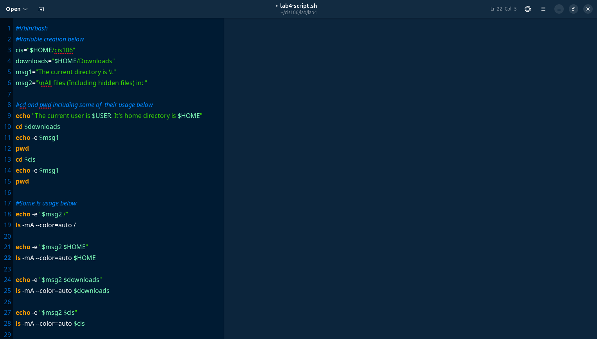
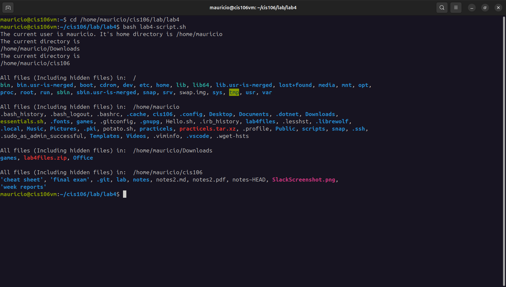
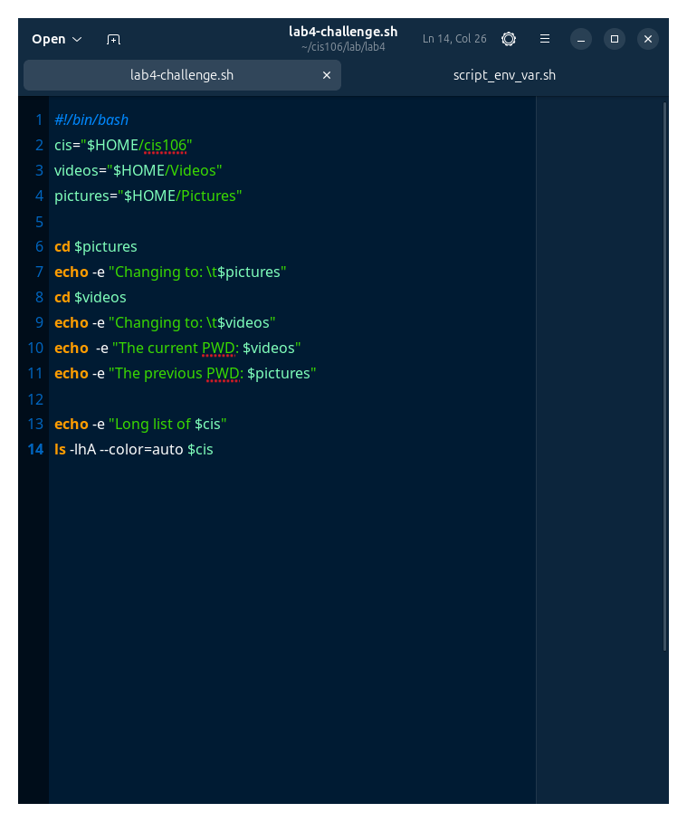
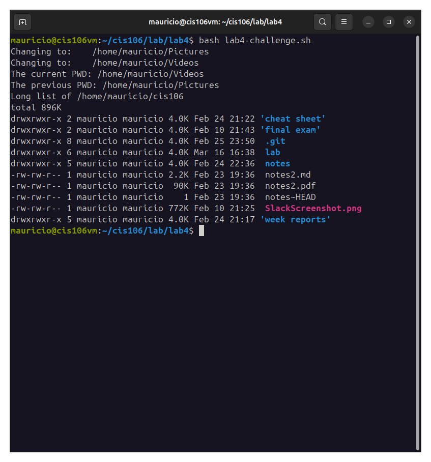

# Lab 4 Submission

## Question 1 | Moving around the file system

## Question 2 | The ls command

## Question 3 | Shell Scripting

[lab4](lab4-script.sh)

## Question 4 | Challenge Write a script

[lab4](lab4-challenge.sh)

