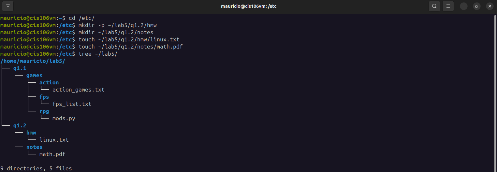
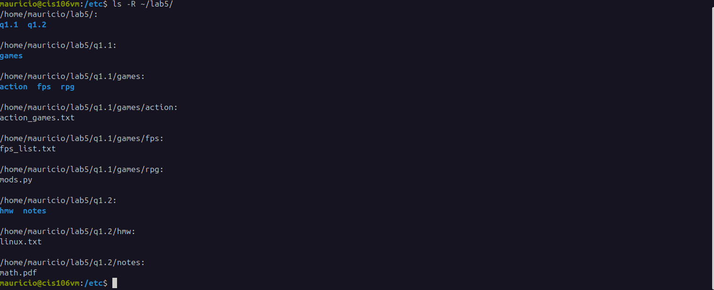

# Lab 5 Submission

## Question 1.1: Creating Files and Directories - Part 1 & Part 2

### Part 1

### Part 2

## Question 2: Removing Files and Directories

## Question 3: Moving Files and Directories

## Question 4: Copying Files and Directories

## Challenge Question:

