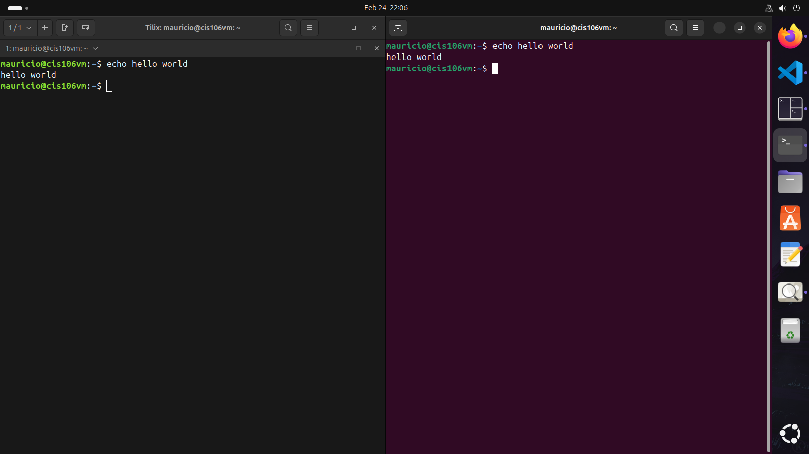
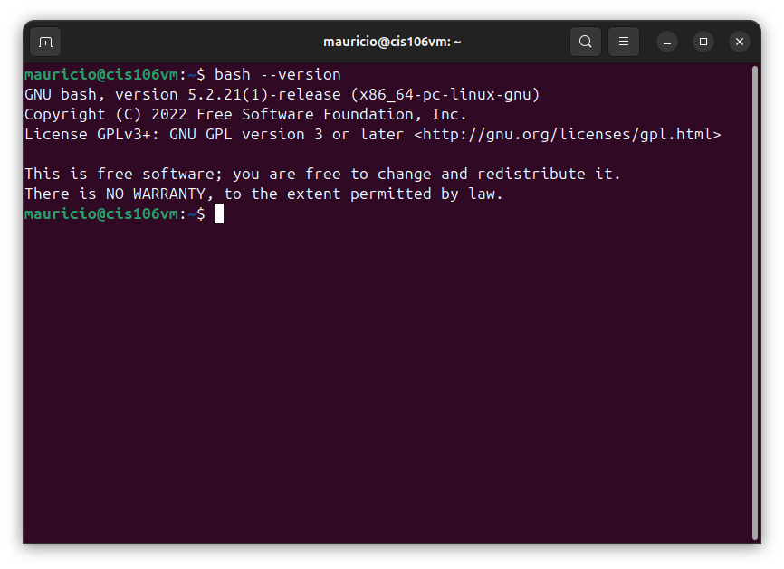
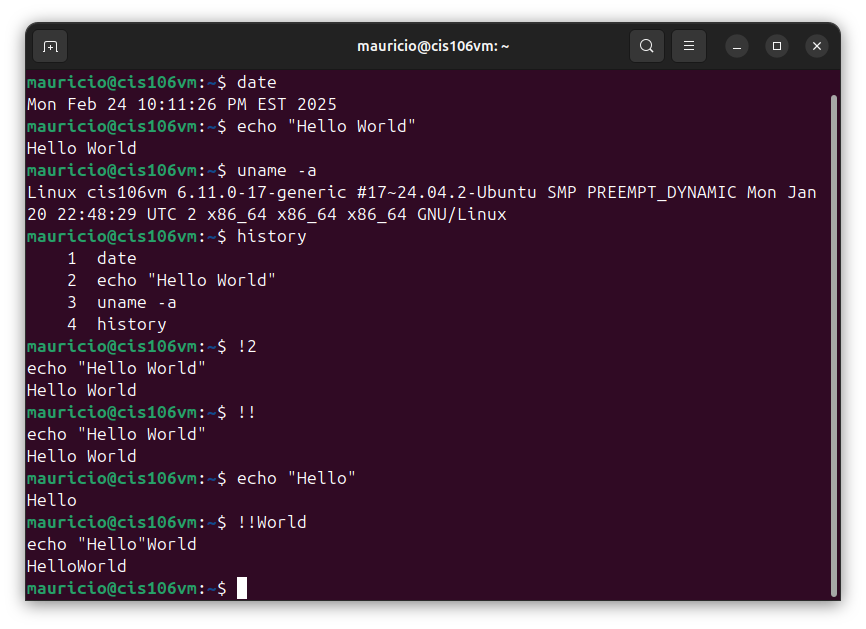
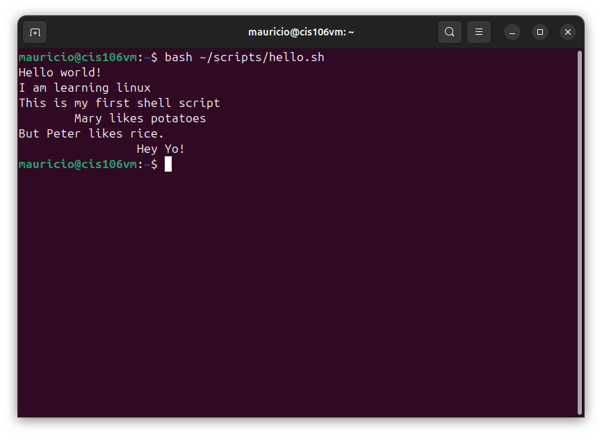
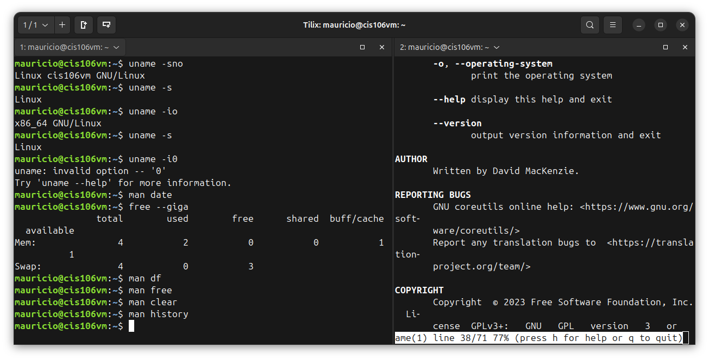
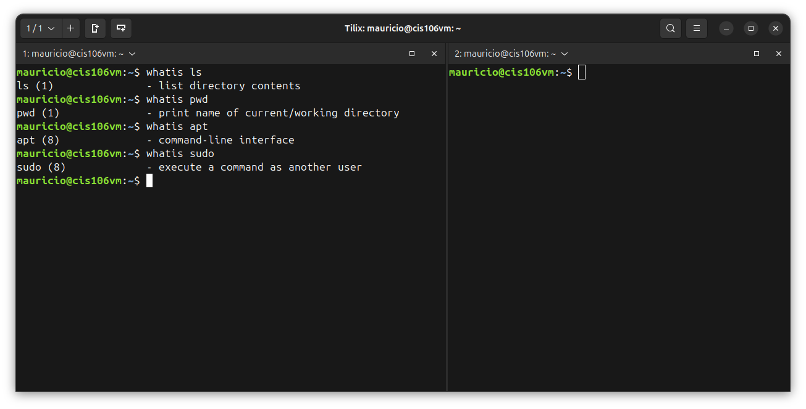
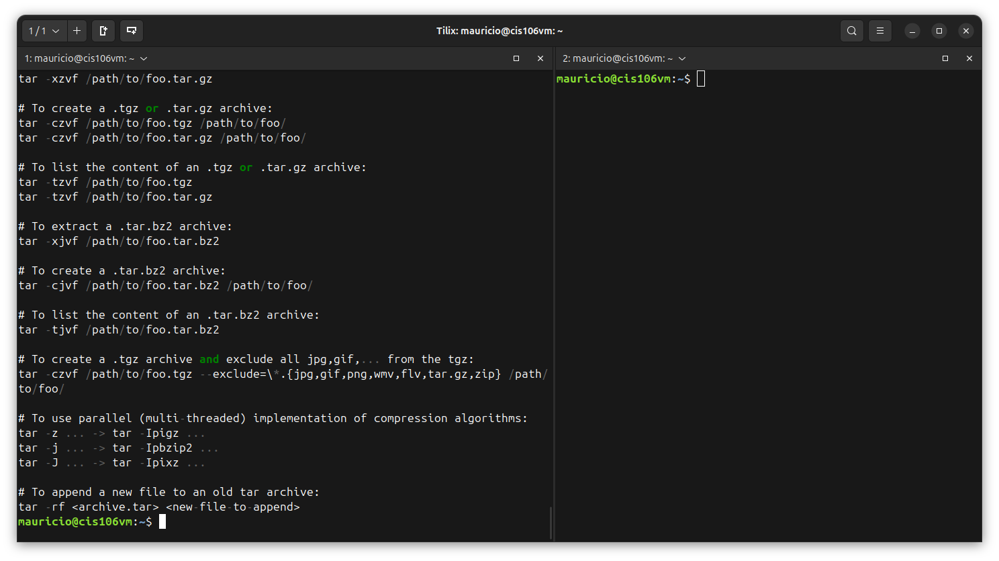
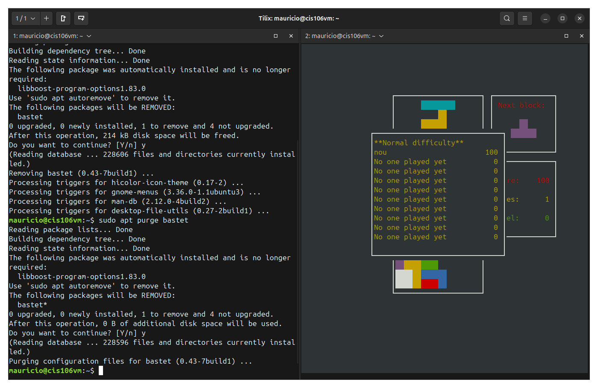
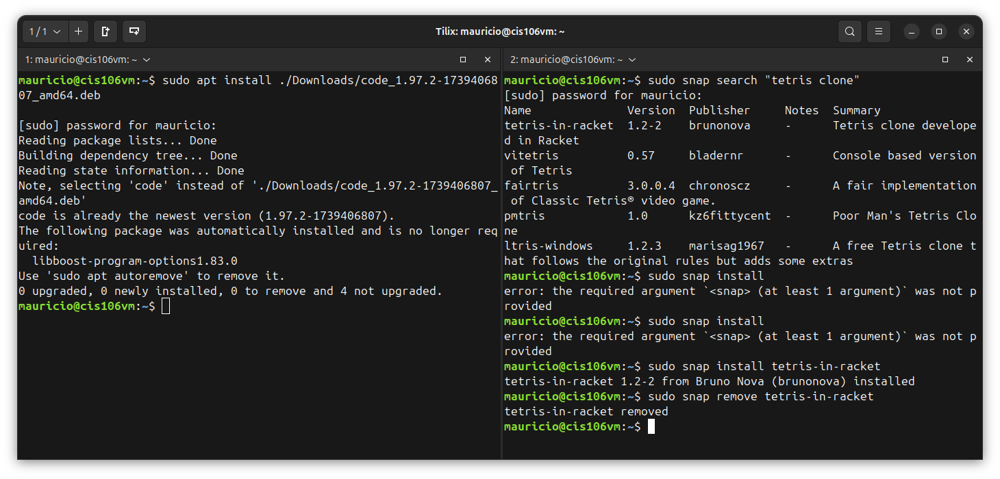

# Week Report 3
## Completed work for week 3

- [Lab3.md](https://github.com/cmau1402/cis106/blob/main/lab/lab3/lab3.md) 
- [Notes 3]()

## Practice

### Practice 1

### Practice 2

### Practice 3

### Practice 4

### Practice 5

### Practice 6

### Practice 7

### Practice 1 Managing Software

### Practice 3 Managing Software

