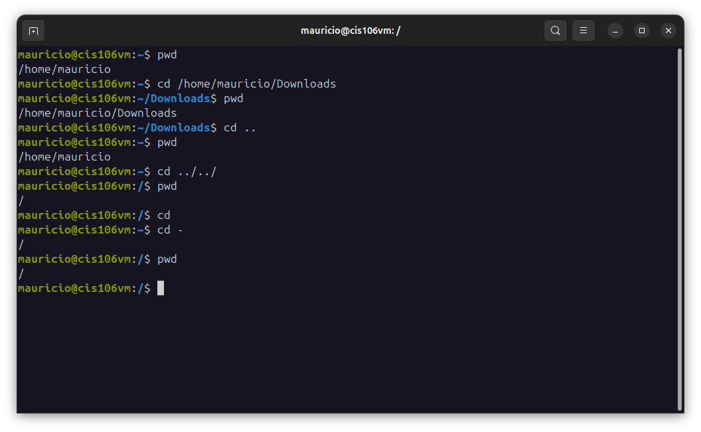

# Week Report 4
## Completed work for week 4

[lab4.md](https://github.com/cmau1402/cis106/blob/main/lab/lab4/lab4.md)
[notes4.md](https://github.com/cmau1402/cis106/blob/main/notes/notes4/notes4.md)

## Practice

### Practice 1

### Practice 2

### Practice 3

### Practice 4

