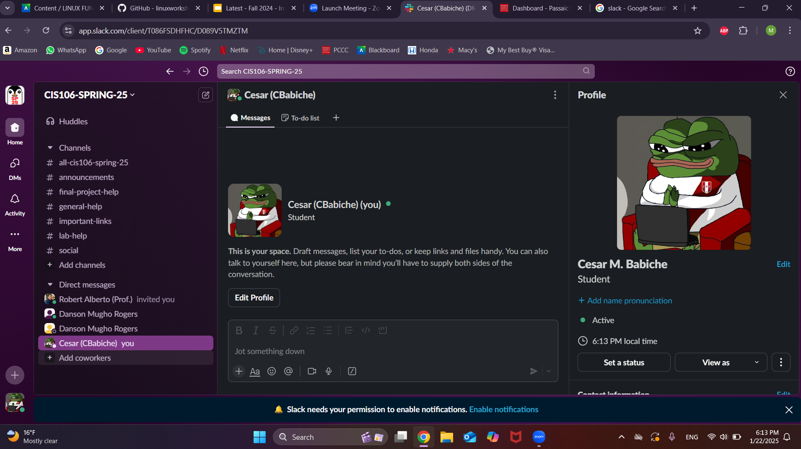
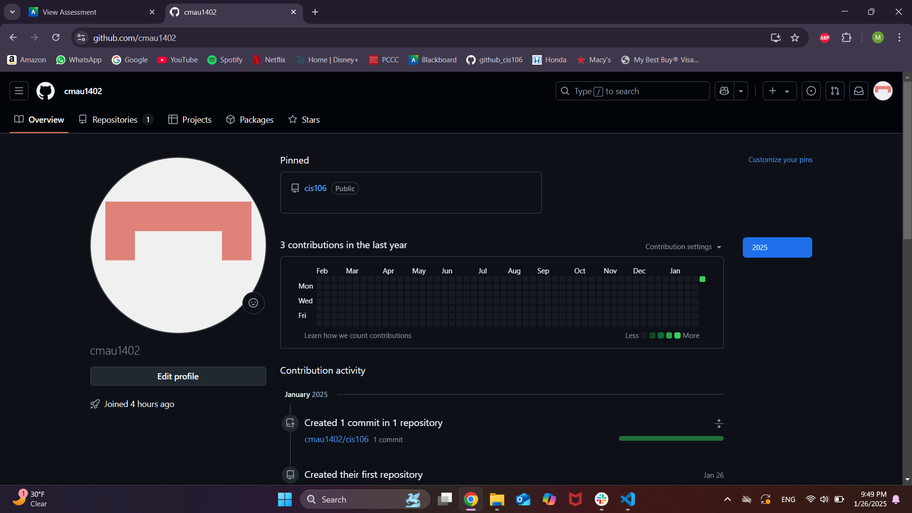

---

Name: Cesar M. Babiche
Course: CIS-106
Semester: Spring-25

---

## Week Report 1 Submission

## Slack Screenshot

## Github Screenshot

## Acknowledgements
* By submitting this assignment I [Cesar M. Babiche] acknowledge that I have read the syllabus and final project description
* I also acknowledge that I have written down any questions that I have for the professor and will ask them class or via slack 1:1